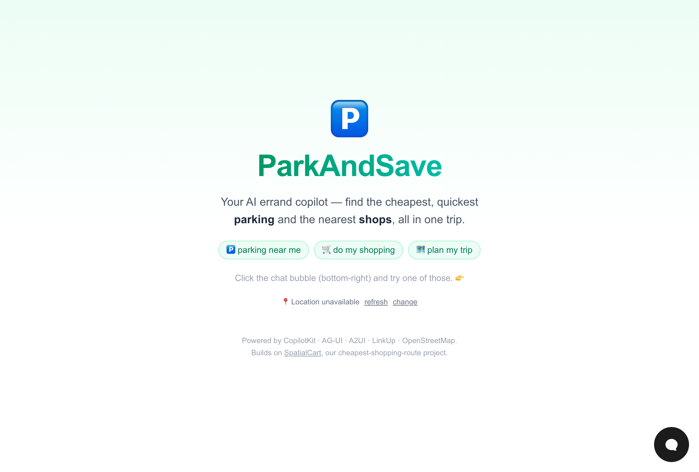

# 🅿️ ParkAndSave

**Your AI errand copilot — find the cheapest, quickest parking and the nearest shops, all in one trip.**

**🔴 Live demo: <https://parkandsave-agent.vercel.app>**



Built for the **Generative UI Hackathon** (CopilotKit track). You chat with an AI
agent that searches the real world live and **generates its own UI** — interactive
cards — instead of replying with walls of text.

It merges two ideas: [**SpatialCart**](https://spatialcart.up.railway.app/) (find the
cheapest shopping route across nearby supermarkets) and a friend's **cheap-parking**
idea, into a single "plan my errand trip" assistant.

## What it does

Ask it things like:

- *"Find cheap parking near me"*
- *"Do my food shopping"* — lists real nearby supermarkets
- *"Plan my trip"* — combines shops **and** parking into one trip plan

The agent then:

1. Reads your **current location** (browser GPS → OpenStreetMap reverse-geocode).
2. Finds **real supermarkets** nearby (OpenStreetMap / Overpass).
3. Searches the **live web** for car-park prices & availability (LinkUp).
4. **Generates an A2UI surface** — cards with prices, distances, badges and
   Book/View buttons — rendered live in the chat.

## The required hackathon stack

| Tool | Role |
|------|------|
| **CopilotKit** | In-app AI copilot (chat UI + runtime) |
| **AG-UI** | Streaming agent ↔ frontend protocol |
| **A2UI** | Declarative Generative UI — the agent authors the component tree, rendered by `@copilotkit/a2ui-renderer` |
| **LinkUp** | Live, sourced web search for real parking data |

Plus **Claude** (`claude-sonnet-4-6`) as the agent, and **OpenStreetMap**
(Nominatim + Overpass) for free location & supermarket data.

## How it's wired

- `src/app/api/copilotkit/route.ts` — CopilotKit runtime + Anthropic adapter.
- `src/app/api/search/route.ts` — server-side LinkUp search (keeps the API key secret).
- `src/app/api/shops/route.ts` — OpenStreetMap supermarket lookup.
- `src/app/page.tsx` — the three agent tools (`searchLiveWeb`, `findNearbyShops`,
  `render_a2ui`) via `useCopilotAction`, plus geolocation.
- `src/app/A2UISurface.tsx` — renders an agent-generated A2UI v0.9 component tree.

## Run it locally

```bash
npm install
# create .env.local with:
#   ANTHROPIC_API_KEY=sk-ant-...
#   LINKUP_API_KEY=...
npm run dev   # → http://localhost:3000
```

Open the app, click the chat bubble, allow location, and try *"plan my trip"*.

---

🤖 Built with [Claude Code](https://claude.com/claude-code).
